# Arquitetura forge_llm v2 — Extensão do ForgeBase

> "Forjar é transformar pensamento em estrutura."

Este documento propõe a arquitetura do **forge_llm** como uma **extensão natural do ForgeBase**, herdando suas classes base, padrões de observabilidade e princípios de Clean Architecture.

---

## Visão Geral

O forge_llm estende o ForgeBase para criar um framework de **acesso agnóstico a LLMs** com:

- **Herança das classes base** do ForgeBase (EntityBase, UseCaseBase, PortBase, AdapterBase)
- **Observabilidade nativa** (LogService, TrackMetrics)
- **Exceções de domínio** específicas para LLM
- **CLI First** como primeira interface de validação
- **Sistema de plugins** para extensibilidade
- **Configuração declarativa** via BuildSpec (YAML/JSON)

### Princípio Central

```
ForgeBase (infraestrutura cognitiva)
    └── forge_llm (especialização para LLMs)
            └── Seu Projeto (agentes customizados)
```

---

## Hierarquia de Herança

```
ForgeBase                          forge_llm
─────────────────────────────────────────────────────────────────
EntityBase                    ──▶  LLMModelConfig
                              ──▶  LLMCallConfig
                              ──▶  ChatMessage
                              ──▶  ToolSchema

ValueObjectBase               ──▶  TokenCount
                              ──▶  ModelIdentifier

UseCaseBase                   ──▶  AgentBase
                                      ├── ChatAgent
                                      ├── CodeAgent
                                      └── ToolAgent

PortBase                      ──▶  ILLMProviderPort
                              ──▶  IToolExecutorPort
                              ──▶  ISessionStoragePort

AdapterBase                   ──▶  OpenAIAdapter
                              ──▶  AnthropicAdapter
                              ──▶  CodexAdapter
                              ──▶  CLIAdapter
                              ──▶  HTTPAdapter

DomainException               ──▶  ForgeLLMException
                                      ├── ProviderError
                                      ├── TokenLimitExceeded
                                      ├── ToolExecutionError
                                      └── ConfigurationError

LogService                    ──▶  (usado diretamente)
TrackMetrics                  ──▶  (usado diretamente)
ForgeTestCase                 ──▶  ForgeLLMTestCase
```

---

## Estrutura de Diretórios

```
forge_llm/
├── src/
│   ├── __init__.py
│   │
│   ├── domain/                          # Núcleo de negócio (PURO)
│   │   ├── __init__.py
│   │   ├── entities/
│   │   │   ├── __init__.py
│   │   │   ├── llm_model_config.py      # extends EntityBase
│   │   │   ├── llm_call_config.py       # extends EntityBase
│   │   │   ├── chat_message.py          # extends EntityBase
│   │   │   ├── tool_schema.py           # extends EntityBase
│   │   │   └── conversation.py          # extends EntityBase
│   │   │
│   │   ├── value_objects/
│   │   │   ├── __init__.py
│   │   │   ├── token_count.py           # extends ValueObjectBase
│   │   │   ├── model_identifier.py      # extends ValueObjectBase
│   │   │   └── provider_type.py         # extends ValueObjectBase
│   │   │
│   │   ├── exceptions.py                # extends DomainException
│   │   └── validators/
│   │       ├── __init__.py
│   │       └── config_validators.py
│   │
│   ├── application/                     # Casos de uso e orquestração
│   │   ├── __init__.py
│   │   ├── agents/
│   │   │   ├── __init__.py
│   │   │   ├── agent_base.py            # extends UseCaseBase
│   │   │   ├── chat_agent.py            # extends AgentBase
│   │   │   ├── code_agent.py            # extends AgentBase
│   │   │   └── tool_agent.py            # extends AgentBase
│   │   │
│   │   ├── session/
│   │   │   ├── __init__.py
│   │   │   ├── chat_session.py          # Gerenciador de contexto
│   │   │   └── session_compactor.py     # Estratégias de compactação
│   │   │
│   │   ├── ports/                       # Interfaces (contratos)
│   │   │   ├── __init__.py
│   │   │   ├── llm_provider_port.py     # extends PortBase
│   │   │   ├── tool_executor_port.py    # extends PortBase
│   │   │   ├── session_storage_port.py  # extends PortBase
│   │   │   └── mcp_port.py              # extends PortBase
│   │   │
│   │   └── dtos/
│   │       ├── __init__.py
│   │       ├── chat_input.py
│   │       ├── chat_output.py
│   │       └── stream_chunk.py
│   │
│   ├── infrastructure/                  # Implementações concretas
│   │   ├── __init__.py
│   │   ├── providers/
│   │   │   ├── __init__.py
│   │   │   ├── openai_adapter.py        # extends AdapterBase
│   │   │   ├── anthropic_adapter.py     # extends AdapterBase
│   │   │   ├── codex_adapter.py         # extends AdapterBase
│   │   │   └── ollama_adapter.py        # extends AdapterBase
│   │   │
│   │   ├── tools/
│   │   │   ├── __init__.py
│   │   │   ├── tool_executor.py
│   │   │   └── mcp_client.py
│   │   │
│   │   ├── storage/
│   │   │   ├── __init__.py
│   │   │   ├── memory_session_storage.py
│   │   │   └── file_session_storage.py
│   │   │
│   │   └── config/
│   │       ├── __init__.py
│   │       ├── build_spec.py            # Loader de config
│   │       └── env_loader.py
│   │
│   ├── adapters/                        # Interfaces externas
│   │   ├── __init__.py
│   │   ├── cli/
│   │   │   ├── __init__.py
│   │   │   ├── forge_cli.py             # extends CLIAdapter
│   │   │   └── commands/
│   │   │       ├── chat_command.py
│   │   │       ├── build_command.py
│   │   │       └── test_command.py
│   │   │
│   │   └── http/
│   │       ├── __init__.py
│   │       └── forge_api.py             # FastAPI/Flask
│   │
│   ├── composition/                     # Composition Root
│   │   ├── __init__.py
│   │   ├── forge_builder.py             # Monta o grafo de objetos
│   │   ├── plugin_registry.py           # Registro de extensões
│   │   └── build_context.py             # Contexto de build
│   │
│   └── observability/                   # Re-export do ForgeBase
│       ├── __init__.py
│       └── llm_metrics.py               # Métricas específicas de LLM
│
├── tests/
│   ├── __init__.py
│   ├── unit/
│   │   ├── domain/
│   │   ├── application/
│   │   └── infrastructure/
│   ├── integration/
│   ├── cognitive/                       # Testes cognitivos
│   └── cli/                             # Testes CLI First
│
├── examples/
│   ├── simple_chat.py
│   ├── code_agent.py
│   ├── custom_provider.py
│   └── mcp_integration.py
│
├── configs/
│   ├── default_agent.yaml
│   ├── code_agent.yaml
│   └── providers/
│       ├── openai.yaml
│       └── anthropic.yaml
│
└── cli.py                               # Entry point CLI
```

---

## Diagrama de Classes (PlantUML)

```plantuml
@startuml forge_llm_v2
skinparam style strictuml
skinparam classAttributeIconSize 0

' =======================
' FORGEBASE (HERDADO2)
' =======================

package "forgebase" {
    abstract class EntityBase {
        - _id: str
        + validate()
    }

    abstract class ValueObjectBase {
        + __eq__()
        + __hash__()
    }

    abstract class UseCaseBase {
        + execute(input) : output
    }

    abstract class PortBase {
        + info() : dict
    }

    abstract class AdapterBase {
        + name: str
    }

    abstract class DomainException

    class LogService {
        + info(msg, **ctx)
        + error(msg, **ctx)
        + correlation_context(id)
    }

    class TrackMetrics {
        + increment(name, **tags)
        + timer(name)
        + histogram(name, value)
    }
}

' =======================
' DOMAIN LAYER
' =======================

package "forge_llm.domain" {
    class LLMModelConfig {
        + model_name: str
        + temperature: float
        + max_tokens: int
        + top_p: float
        + validate()
    }

    class LLMCallConfig {
        + stream: bool
        + timeout_ms: int
        + retry_count: int
    }

    class ChatMessage {
        + role: str
        + content: str
        + tool_calls: list
        + timestamp: datetime
    }

    class ToolSchema {
        + name: str
        + description: str
        + parameters: dict
    }

    class TokenCount {
        + input_tokens: int
        + output_tokens: int
        + total: int
    }

    class ModelIdentifier {
        + provider: str
        + model: str
        + version: str
    }

    abstract class ForgeLLMException
    class ProviderError
    class TokenLimitExceeded
    class ToolExecutionError
    class ConfigurationError

    LLMModelConfig --|> EntityBase
    LLMCallConfig --|> EntityBase
    ChatMessage --|> EntityBase
    ToolSchema --|> EntityBase
    TokenCount --|> ValueObjectBase
    ModelIdentifier --|> ValueObjectBase

    ForgeLLMException --|> DomainException
    ProviderError --|> ForgeLLMException
    TokenLimitExceeded --|> ForgeLLMException
    ToolExecutionError --|> ForgeLLMException
    ConfigurationError --|> ForgeLLMException
}

' =======================
' APPLICATION LAYER
' =======================

package "forge_llm.application" {
    abstract class AgentBase {
        - session: ChatSession
        - provider: ILLMProviderPort
        - model_config: LLMModelConfig
        - log: LogService
        - metrics: TrackMetrics
        + execute(input: ChatInput) : ChatOutput
        + chat(messages: list) : ChatMessage
        + stream_chat(messages: list) : Generator
    }

    class ChatAgent {
        - system_prompt: str
        + execute(input) : ChatOutput
    }

    class CodeAgent {
        - language: str
        - sandbox: bool
        + execute(input) : ChatOutput
        + generate_code(spec: str) : str
    }

    class ToolAgent {
        - tools: list[ToolSchema]
        + execute(input) : ChatOutput
        + call_tool(name, args) : any
    }

    class ChatSession {
        - messages: list[ChatMessage]
        - max_tokens: int
        - compactor: SessionCompactor
        + append(message: ChatMessage)
        + get_context() : list[ChatMessage]
        + compact()
        + full_history() : list[ChatMessage]
    }

    interface ILLMProviderPort {
        + chat(messages, config) : ChatMessage
        + stream_chat(messages, config) : Generator
        + count_tokens(text) : TokenCount
        + supported_models() : list[str]
    }

    interface IToolExecutorPort {
        + execute(tool_name, args) : any
        + list_tools() : list[ToolSchema]
    }

    interface ISessionStoragePort {
        + save(session_id, session: ChatSession)
        + load(session_id) : ChatSession
        + delete(session_id)
    }

    AgentBase --|> UseCaseBase
    ChatAgent --|> AgentBase
    CodeAgent --|> AgentBase
    ToolAgent --|> AgentBase

    ILLMProviderPort --|> PortBase
    IToolExecutorPort --|> PortBase
    ISessionStoragePort --|> PortBase

    AgentBase --> ChatSession : uses
    AgentBase --> ILLMProviderPort : uses
    AgentBase --> LLMModelConfig : uses
    AgentBase --> LogService : uses
    AgentBase --> TrackMetrics : uses
}

' =======================
' INFRASTRUCTURE LAYER
' =======================

package "forge_llm.infrastructure" {
    class OpenAIAdapter {
        - client: OpenAI
        - api_key: str
        + chat(messages, config) : ChatMessage
        + stream_chat(messages, config) : Generator
    }

    class AnthropicAdapter {
        - client: Anthropic
        - api_key: str
        + chat(messages, config) : ChatMessage
        + stream_chat(messages, config) : Generator
    }

    class OllamaAdapter {
        - base_url: str
        + chat(messages, config) : ChatMessage
    }

    class MemorySessionStorage {
        - storage: dict
        + save(session_id, session)
        + load(session_id) : ChatSession
    }

    class FileSessionStorage {
        - base_path: str
        + save(session_id, session)
        + load(session_id) : ChatSession
    }

    OpenAIAdapter ..|> ILLMProviderPort
    AnthropicAdapter ..|> ILLMProviderPort
    OllamaAdapter ..|> ILLMProviderPort

    OpenAIAdapter --|> AdapterBase
    AnthropicAdapter --|> AdapterBase
    OllamaAdapter --|> AdapterBase

    MemorySessionStorage ..|> ISessionStoragePort
    FileSessionStorage ..|> ISessionStoragePort
}

' =======================
' COMPOSITION ROOT
' =======================

package "forge_llm.composition" {
    class BuildSpec {
        + agent: dict
        + provider: dict
        + model: dict
        + session: dict
        + tools: list
        + observability: dict
        + from_yaml(path) : BuildSpec
        + from_dict(data) : BuildSpec
    }

    class BuildContext {
        - spec: BuildSpec
        - cache: dict
        - registry: PluginRegistry
        + get(path: str) : any
        + resolve(kind, type_id) : class
    }

    class PluginRegistry {
        - _registry: dict
        + register(kind, type_id, cls)
        + resolve(kind, type_id) : class
        + list(kind) : list[str]
        + register_defaults()
    }

    class ForgeBuilder {
        - registry: PluginRegistry
        - log: LogService
        + build(spec: BuildSpec) : AgentBase
        - build_provider(ctx) : ILLMProviderPort
        - build_session(ctx) : ChatSession
        - build_agent(ctx) : AgentBase
        - build_observability(ctx) : tuple
    }

    ForgeBuilder --> BuildSpec : consumes
    ForgeBuilder --> BuildContext : creates
    ForgeBuilder --> PluginRegistry : uses
    ForgeBuilder ..> AgentBase : creates
    ForgeBuilder ..> ILLMProviderPort : creates
    ForgeBuilder ..> ChatSession : creates

    BuildContext --> BuildSpec
    BuildContext --> PluginRegistry
}

' =======================
' ADAPTERS (CLI/HTTP)
' =======================

package "forge_llm.adapters" {
    class ForgeCLI {
        - builder: ForgeBuilder
        + chat(spec_path, message)
        + build(spec_path)
        + list_providers()
        + list_agents()
    }

    class ForgeHTTPAdapter {
        - builder: ForgeBuilder
        + POST /chat
        + POST /stream
        + GET /providers
    }

    ForgeCLI --|> AdapterBase
    ForgeHTTPAdapter --|> AdapterBase

    ForgeCLI --> ForgeBuilder : uses
    ForgeHTTPAdapter --> ForgeBuilder : uses
}

@enduml
```



---

## Implementações de Exemplo

### 1. Entidade de Domínio (extends EntityBase)

```python
# src/domain/entities/llm_model_config.py
"""Configuração de modelo LLM."""

from dataclasses import dataclass
from forgebase.domain import EntityBase
from forge_llm.domain.exceptions import ConfigurationError


@dataclass
class LLMModelConfig(EntityBase):
    """
    Configuração de um modelo LLM.

    Define parâmetros como temperature, max_tokens, etc.
    Herda de EntityBase para validação e identidade.
    """

    model_name: str
    temperature: float = 0.7
    max_tokens: int = 2000
    top_p: float = 1.0
    frequency_penalty: float = 0.0
    presence_penalty: float = 0.0

    def __post_init__(self):
        """Inicializar e validar."""
        super().__init__()
        self.validate()

    def validate(self) -> None:
        """Validar invariantes da configuração."""
        if not self.model_name:
            raise ConfigurationError("model_name é obrigatório")

        if not 0.0 <= self.temperature <= 2.0:
            raise ConfigurationError(
                f"temperature deve estar entre 0.0 e 2.0, recebido: {self.temperature}"
            )

        if self.max_tokens < 1:
            raise ConfigurationError(
                f"max_tokens deve ser >= 1, recebido: {self.max_tokens}"
            )

        if not 0.0 <= self.top_p <= 1.0:
            raise ConfigurationError(
                f"top_p deve estar entre 0.0 e 1.0, recebido: {self.top_p}"
            )

    def with_temperature(self, temp: float) -> "LLMModelConfig":
        """Retornar nova config com temperature alterada."""
        return LLMModelConfig(
            model_name=self.model_name,
            temperature=temp,
            max_tokens=self.max_tokens,
            top_p=self.top_p,
            frequency_penalty=self.frequency_penalty,
            presence_penalty=self.presence_penalty,
        )
```

### 2. Exceções de Domínio (extends DomainException)

```python
# src/domain/exceptions.py
"""Exceções de domínio do forge_llm."""

from forgebase.domain.exceptions import DomainException


class ForgeLLMException(DomainException):
    """Base para todas as exceções do forge_llm."""
    pass


class ProviderError(ForgeLLMException):
    """Erro na comunicação com provider LLM."""

    def __init__(self, provider: str, message: str, status_code: int | None = None):
        self.provider = provider
        self.status_code = status_code
        super().__init__(f"[{provider}] {message}")


class TokenLimitExceeded(ForgeLLMException):
    """Limite de tokens excedido."""

    def __init__(self, limit: int, requested: int):
        self.limit = limit
        self.requested = requested
        super().__init__(
            f"Token limit exceeded: {requested} requested, {limit} maximum"
        )


class ToolExecutionError(ForgeLLMException):
    """Erro na execução de ferramenta."""

    def __init__(self, tool_name: str, message: str):
        self.tool_name = tool_name
        super().__init__(f"Tool '{tool_name}' failed: {message}")


class ConfigurationError(ForgeLLMException):
    """Erro de configuração."""
    pass


class SessionOverflowError(ForgeLLMException):
    """Sessão excedeu limite de contexto."""

    def __init__(self, current_tokens: int, max_tokens: int):
        self.current_tokens = current_tokens
        self.max_tokens = max_tokens
        super().__init__(
            f"Session overflow: {current_tokens} tokens, max {max_tokens}"
        )
```

### 3. Port (extends PortBase)

```python
# src/application/ports/llm_provider_port.py
"""Port para providers de LLM."""

from abc import abstractmethod
from typing import Generator
from forgebase.application import PortBase

from forge_llm.domain.entities import ChatMessage, LLMModelConfig, LLMCallConfig
from forge_llm.domain.value_objects import TokenCount


class ILLMProviderPort(PortBase):
    """
    Interface para providers de LLM.

    Define o contrato que qualquer provider deve implementar.
    Herda de PortBase para rastreabilidade.
    """

    @abstractmethod
    def chat(
        self,
        messages: list[ChatMessage],
        model_config: LLMModelConfig,
        call_config: LLMCallConfig | None = None,
    ) -> ChatMessage:
        """
        Enviar mensagens e receber resposta.

        :param messages: Lista de mensagens do chat
        :param model_config: Configuração do modelo
        :param call_config: Configuração da chamada (opcional)
        :return: Mensagem de resposta do assistente
        """
        pass

    @abstractmethod
    def stream_chat(
        self,
        messages: list[ChatMessage],
        model_config: LLMModelConfig,
        call_config: LLMCallConfig | None = None,
    ) -> Generator[str, None, None]:
        """
        Enviar mensagens e receber resposta em streaming.

        :param messages: Lista de mensagens do chat
        :param model_config: Configuração do modelo
        :param call_config: Configuração da chamada (opcional)
        :yields: Chunks de texto da resposta
        """
        pass

    @abstractmethod
    def count_tokens(self, text: str, model: str) -> TokenCount:
        """
        Contar tokens de um texto.

        :param text: Texto para contar tokens
        :param model: Nome do modelo (para tokenizer correto)
        :return: Contagem de tokens
        """
        pass

    @abstractmethod
    def supported_models(self) -> list[str]:
        """
        Listar modelos suportados pelo provider.

        :return: Lista de nomes de modelos
        """
        pass
```

### 4. AgentBase (extends UseCaseBase)

```python
# src/application/agents/agent_base.py
"""Classe base para agentes LLM."""

from abc import abstractmethod
from typing import Generator

from forgebase.application import UseCaseBase
from forgebase.observability import LogService, TrackMetrics

from forge_llm.domain.entities import ChatMessage, LLMModelConfig, LLMCallConfig
from forge_llm.domain.exceptions import ProviderError
from forge_llm.application.ports import ILLMProviderPort
from forge_llm.application.session import ChatSession
from forge_llm.application.dtos import ChatInput, ChatOutput


class AgentBase(UseCaseBase[ChatInput, ChatOutput]):
    """
    Classe base abstrata para agentes LLM.

    Herda de UseCaseBase do ForgeBase, garantindo:
    - Interface execute() padronizada
    - Observabilidade integrada
    - Testabilidade

    Responsabilidades:
    - Orquestrar chamadas ao provider
    - Gerenciar sessão de chat
    - Aplicar configuração de modelo
    - Emitir logs e métricas

    Não conhece:
    - Como o provider é criado
    - Como a sessão é instanciada
    - De onde vem a configuração
    """

    def __init__(
        self,
        provider: ILLMProviderPort,
        session: ChatSession,
        model_config: LLMModelConfig,
        log: LogService,
        metrics: TrackMetrics,
    ):
        """
        Inicializar agente com dependências injetadas.

        :param provider: Provider de LLM (via Port)
        :param session: Gerenciador de sessão
        :param model_config: Configuração do modelo
        :param log: Serviço de logging
        :param metrics: Coletor de métricas
        """
        self.provider = provider
        self.session = session
        self.model_config = model_config
        self.log = log
        self.metrics = metrics

    def execute(self, input_dto: ChatInput) -> ChatOutput:
        """
        Executar interação com o agente.

        Implementação do contrato UseCaseBase.

        :param input_dto: Input com mensagem do usuário
        :return: Output com resposta do agente
        """
        with self.metrics.timer("agent.execute_ms"):
            try:
                # Adicionar mensagem do usuário à sessão
                user_message = ChatMessage(role="user", content=input_dto.message)
                self.session.append(user_message)

                # Obter contexto da sessão
                context = self.session.get_context()

                # Chamar provider
                response = self._call_provider(context, input_dto.call_config)

                # Adicionar resposta à sessão
                self.session.append(response)

                # Logging
                self.log.info(
                    "Agent executed",
                    agent=self.__class__.__name__,
                    input_tokens=len(input_dto.message.split()),
                    output_tokens=len(response.content.split()),
                )

                # Métricas
                self.metrics.increment(
                    "agent.messages_processed",
                    agent=self.__class__.__name__,
                    status="success",
                )

                return ChatOutput(
                    message=response.content,
                    role=response.role,
                    session_id=self.session.session_id,
                )

            except ProviderError as e:
                self.log.error("Provider error", error=str(e), provider=e.provider)
                self.metrics.increment(
                    "agent.messages_processed",
                    agent=self.__class__.__name__,
                    status="provider_error",
                )
                raise

    def _call_provider(
        self,
        messages: list[ChatMessage],
        call_config: LLMCallConfig | None = None,
    ) -> ChatMessage:
        """
        Chamar o provider com as mensagens.

        Método interno que pode ser sobrescrito por subclasses.
        """
        return self.provider.chat(
            messages=messages,
            model_config=self.model_config,
            call_config=call_config,
        )

    def chat(self, message: str) -> str:
        """
        Atalho para chat simples.

        :param message: Mensagem do usuário
        :return: Resposta do agente (texto)
        """
        output = self.execute(ChatInput(message=message))
        return output.message

    def stream_chat(
        self,
        message: str,
        call_config: LLMCallConfig | None = None,
    ) -> Generator[str, None, None]:
        """
        Chat com streaming.

        :param message: Mensagem do usuário
        :param call_config: Configuração da chamada
        :yields: Chunks da resposta
        """
        user_message = ChatMessage(role="user", content=message)
        self.session.append(user_message)

        context = self.session.get_context()

        full_response = ""
        for chunk in self.provider.stream_chat(
            messages=context,
            model_config=self.model_config,
            call_config=call_config,
        ):
            full_response += chunk
            yield chunk

        # Adicionar resposta completa à sessão
        assistant_message = ChatMessage(role="assistant", content=full_response)
        self.session.append(assistant_message)

    @abstractmethod
    def _get_system_prompt(self) -> str | None:
        """
        Retornar system prompt do agente.

        Deve ser implementado por subclasses.
        """
        pass
```

### 5. Adapter Concreto (extends AdapterBase)

```python
# src/infrastructure/providers/openai_adapter.py
"""Adapter para OpenAI API."""

from typing import Generator
import openai

from forgebase.adapters import AdapterBase
from forgebase.observability import LogService, TrackMetrics

from forge_llm.domain.entities import ChatMessage, LLMModelConfig, LLMCallConfig
from forge_llm.domain.value_objects import TokenCount
from forge_llm.domain.exceptions import ProviderError
from forge_llm.application.ports import ILLMProviderPort


class OpenAIAdapter(AdapterBase, ILLMProviderPort):
    """
    Adapter para OpenAI API.

    Implementa ILLMProviderPort usando a API da OpenAI.
    Herda de AdapterBase para instrumentação.
    """

    SUPPORTED_MODELS = [
        "gpt-4",
        "gpt-4-turbo",
        "gpt-4o",
        "gpt-4o-mini",
        "gpt-3.5-turbo",
        "o1-preview",
        "o1-mini",
    ]

    def __init__(
        self,
        api_key: str,
        log: LogService,
        metrics: TrackMetrics,
        organization: str | None = None,
        base_url: str | None = None,
    ):
        """
        Inicializar adapter OpenAI.

        :param api_key: Chave de API
        :param log: Serviço de logging
        :param metrics: Coletor de métricas
        :param organization: ID da organização (opcional)
        :param base_url: URL base customizada (opcional)
        """
        super().__init__()
        self.log = log
        self.metrics = metrics

        self.client = openai.OpenAI(
            api_key=api_key,
            organization=organization,
            base_url=base_url,
        )

    def chat(
        self,
        messages: list[ChatMessage],
        model_config: LLMModelConfig,
        call_config: LLMCallConfig | None = None,
    ) -> ChatMessage:
        """Enviar mensagens e receber resposta."""
        with self.metrics.timer("provider.openai.chat_ms"):
            try:
                # Converter para formato OpenAI
                openai_messages = [
                    {"role": m.role, "content": m.content}
                    for m in messages
                ]

                # Chamar API
                response = self.client.chat.completions.create(
                    model=model_config.model_name,
                    messages=openai_messages,
                    temperature=model_config.temperature,
                    max_tokens=model_config.max_tokens,
                    top_p=model_config.top_p,
                    frequency_penalty=model_config.frequency_penalty,
                    presence_penalty=model_config.presence_penalty,
                )

                # Extrair resposta
                content = response.choices[0].message.content

                # Métricas de tokens
                self.metrics.histogram(
                    "provider.openai.input_tokens",
                    response.usage.prompt_tokens,
                )
                self.metrics.histogram(
                    "provider.openai.output_tokens",
                    response.usage.completion_tokens,
                )

                self.log.info(
                    "OpenAI chat completed",
                    model=model_config.model_name,
                    input_tokens=response.usage.prompt_tokens,
                    output_tokens=response.usage.completion_tokens,
                )

                return ChatMessage(
                    role="assistant",
                    content=content,
                )

            except openai.APIError as e:
                self.log.error("OpenAI API error", error=str(e))
                self.metrics.increment("provider.openai.errors", error_type="api")
                raise ProviderError("openai", str(e), status_code=e.status_code)

            except openai.RateLimitError as e:
                self.log.warning("OpenAI rate limit", error=str(e))
                self.metrics.increment("provider.openai.errors", error_type="rate_limit")
                raise ProviderError("openai", "Rate limit exceeded", status_code=429)

    def stream_chat(
        self,
        messages: list[ChatMessage],
        model_config: LLMModelConfig,
        call_config: LLMCallConfig | None = None,
    ) -> Generator[str, None, None]:
        """Enviar mensagens e receber resposta em streaming."""
        try:
            openai_messages = [
                {"role": m.role, "content": m.content}
                for m in messages
            ]

            stream = self.client.chat.completions.create(
                model=model_config.model_name,
                messages=openai_messages,
                temperature=model_config.temperature,
                max_tokens=model_config.max_tokens,
                stream=True,
            )

            for chunk in stream:
                if chunk.choices[0].delta.content:
                    yield chunk.choices[0].delta.content

        except openai.APIError as e:
            raise ProviderError("openai", str(e))

    def count_tokens(self, text: str, model: str) -> TokenCount:
        """Contar tokens de um texto."""
        import tiktoken

        try:
            encoding = tiktoken.encoding_for_model(model)
            tokens = encoding.encode(text)
            return TokenCount(input_tokens=len(tokens), output_tokens=0)
        except Exception:
            # Fallback: estimativa
            estimated = len(text.split()) * 1.3
            return TokenCount(input_tokens=int(estimated), output_tokens=0)

    def supported_models(self) -> list[str]:
        """Listar modelos suportados."""
        return self.SUPPORTED_MODELS.copy()
```

### 6. ForgeBuilder (Composition Root)

```python
# src/composition/forge_builder.py
"""Builder central do forge_llm."""

from forgebase.observability import LogService, TrackMetrics

from forge_llm.domain.entities import LLMModelConfig
from forge_llm.domain.exceptions import ConfigurationError
from forge_llm.application.agents import AgentBase
from forge_llm.application.session import ChatSession
from forge_llm.application.ports import ILLMProviderPort
from forge_llm.composition.build_spec import BuildSpec
from forge_llm.composition.build_context import BuildContext
from forge_llm.composition.plugin_registry import PluginRegistry


class ForgeBuilder:
    """
    Composition Root do forge_llm.

    Responsável por montar o grafo completo de objetos a partir
    de uma especificação declarativa (BuildSpec).

    Regra de Ouro: "Quem usa não cria. Quem cria não usa."
    """

    def __init__(self, registry: PluginRegistry | None = None):
        """
        Inicializar builder.

        :param registry: Registro de plugins (opcional, cria default)
        """
        self.registry = registry or PluginRegistry()
        self.registry.register_defaults()
        self.log = LogService(service_name="forge_builder")

    def build(self, spec: BuildSpec) -> AgentBase:
        """
        Construir agente a partir da especificação.

        :param spec: Especificação declarativa
        :return: Agente pronto para uso
        """
        self.log.info("Building agent", spec=spec.to_dict())

        # Criar contexto de build
        ctx = BuildContext(spec=spec, registry=self.registry)

        # Construir componentes (ordem importa!)
        log, metrics = self._build_observability(ctx)
        provider = self._build_provider(ctx, log, metrics)
        session = self._build_session(ctx)
        model_config = self._build_model_config(ctx)
        agent = self._build_agent(ctx, provider, session, model_config, log, metrics)

        self.log.info(
            "Agent built successfully",
            agent_type=spec.agent.get("type"),
            provider_type=spec.provider.get("type"),
            model=model_config.model_name,
        )

        return agent

    def _build_observability(self, ctx: BuildContext) -> tuple[LogService, TrackMetrics]:
        """Construir serviços de observabilidade."""
        obs_config = ctx.spec.observability or {}

        log = LogService(
            service_name=obs_config.get("service_name", "forge_llm"),
            environment=obs_config.get("environment", "development"),
        )

        if obs_config.get("console_logging", True):
            log.add_console_handler()

        if log_file := obs_config.get("log_file"):
            log.add_file_handler(log_file)

        metrics = TrackMetrics()

        return log, metrics

    def _build_provider(
        self,
        ctx: BuildContext,
        log: LogService,
        metrics: TrackMetrics,
    ) -> ILLMProviderPort:
        """Construir provider de LLM."""
        provider_spec = ctx.spec.provider
        provider_type = provider_spec.get("type")

        if not provider_type:
            raise ConfigurationError("provider.type é obrigatório")

        # Resolver classe via registry
        provider_cls = ctx.resolve("provider", provider_type)

        # Obter configuração
        api_key = self._resolve_api_key(provider_spec)

        # Instanciar
        return provider_cls(
            api_key=api_key,
            log=log,
            metrics=metrics,
            **provider_spec.get("options", {}),
        )

    def _build_session(self, ctx: BuildContext) -> ChatSession:
        """Construir sessão de chat."""
        session_spec = ctx.spec.session or {}

        return ChatSession(
            max_tokens=session_spec.get("max_context_tokens", 8000),
            compact_strategy=session_spec.get("compact_strategy", "truncate"),
        )

    def _build_model_config(self, ctx: BuildContext) -> LLMModelConfig:
        """Construir configuração de modelo."""
        model_spec = ctx.spec.model
        defaults = ctx.spec.defaults or {}

        return LLMModelConfig(
            model_name=model_spec.get("name", "gpt-4"),
            temperature=model_spec.get("temperature", defaults.get("temperature", 0.7)),
            max_tokens=model_spec.get("max_tokens", defaults.get("max_tokens", 2000)),
            top_p=model_spec.get("top_p", defaults.get("top_p", 1.0)),
        )

    def _build_agent(
        self,
        ctx: BuildContext,
        provider: ILLMProviderPort,
        session: ChatSession,
        model_config: LLMModelConfig,
        log: LogService,
        metrics: TrackMetrics,
    ) -> AgentBase:
        """Construir agente."""
        agent_spec = ctx.spec.agent
        agent_type = agent_spec.get("type")

        if not agent_type:
            raise ConfigurationError("agent.type é obrigatório")

        # Resolver classe via registry
        agent_cls = ctx.resolve("agent", agent_type)

        # Extrair configuração específica do agente
        agent_config = {
            k: v for k, v in agent_spec.items()
            if k not in ("type",)
        }

        # Instanciar
        return agent_cls(
            provider=provider,
            session=session,
            model_config=model_config,
            log=log,
            metrics=metrics,
            **agent_config,
        )

    def _resolve_api_key(self, provider_spec: dict) -> str:
        """Resolver API key de env var ou valor direto."""
        import os

        if api_key := provider_spec.get("api_key"):
            return api_key

        if env_var := provider_spec.get("api_key_env"):
            if key := os.getenv(env_var):
                return key
            raise ConfigurationError(f"Env var {env_var} não definida")

        raise ConfigurationError("provider.api_key ou provider.api_key_env é obrigatório")
```

### 7. CLI Adapter (CLI First)

```python
# src/adapters/cli/forge_cli.py
"""CLI do forge_llm - CLI First!"""

import json
import sys
from pathlib import Path

from forgebase.adapters.cli import CLIAdapter

from forge_llm.composition.forge_builder import ForgeBuilder
from forge_llm.composition.build_spec import BuildSpec


class ForgeCLI(CLIAdapter):
    """
    Interface CLI do forge_llm.

    Segue o princípio CLI First: toda funcionalidade
    é validada via CLI antes de expor via HTTP.
    """

    def __init__(self, builder: ForgeBuilder | None = None):
        """Inicializar CLI."""
        super().__init__()
        self.builder = builder or ForgeBuilder()

    def cmd_chat(
        self,
        spec_path: str,
        message: str,
        stream: bool = False,
    ) -> dict:
        """
        Enviar mensagem para um agente.

        Uso:
            forge chat --spec agent.yaml --message "Olá!"
            forge chat --spec agent.yaml --message "Olá!" --stream
        """
        spec = BuildSpec.from_yaml(spec_path)
        agent = self.builder.build(spec)

        if stream:
            output = ""
            for chunk in agent.stream_chat(message):
                print(chunk, end="", flush=True)
                output += chunk
            print()  # newline
            return {"response": output, "stream": True}
        else:
            response = agent.chat(message)
            return {"response": response, "stream": False}

    def cmd_build(self, spec_path: str) -> dict:
        """
        Validar e construir agente (dry-run).

        Uso:
            forge build --spec agent.yaml
        """
        spec = BuildSpec.from_yaml(spec_path)
        agent = self.builder.build(spec)

        return {
            "success": True,
            "agent_type": agent.__class__.__name__,
            "provider": agent.provider.__class__.__name__,
            "model": agent.model_config.model_name,
        }

    def cmd_list_providers(self) -> dict:
        """
        Listar providers disponíveis.

        Uso:
            forge list-providers
        """
        providers = self.builder.registry.list("provider")
        return {"providers": providers}

    def cmd_list_agents(self) -> dict:
        """
        Listar tipos de agente disponíveis.

        Uso:
            forge list-agents
        """
        agents = self.builder.registry.list("agent")
        return {"agents": agents}

    def cmd_interactive(self, spec_path: str) -> None:
        """
        Modo interativo de chat.

        Uso:
            forge interactive --spec agent.yaml
        """
        spec = BuildSpec.from_yaml(spec_path)
        agent = self.builder.build(spec)

        print(f"Agente: {agent.__class__.__name__}")
        print(f"Modelo: {agent.model_config.model_name}")
        print("Digite 'exit' para sair.\n")

        while True:
            try:
                user_input = input("Você: ").strip()

                if user_input.lower() in ("exit", "quit", "sair"):
                    print("Até logo!")
                    break

                if not user_input:
                    continue

                print("Assistente: ", end="", flush=True)
                for chunk in agent.stream_chat(user_input):
                    print(chunk, end="", flush=True)
                print("\n")

            except KeyboardInterrupt:
                print("\nAté logo!")
                break


def main():
    """Entry point."""
    cli = ForgeCLI()
    cli.run(sys.argv[1:])


if __name__ == "__main__":
    main()
```

---

## Arquivo BuildSpec (YAML)

```yaml
# configs/default_agent.yaml
# Configuração declarativa para forge_llm

agent:
  type: chat
  system_prompt: |
    Você é um assistente útil e conciso.
    Responda de forma clara e direta.

provider:
  type: openai
  api_key_env: OPENAI_API_KEY
  options:
    organization: null

model:
  name: gpt-4o
  temperature: 0.7
  max_tokens: 2000
  top_p: 1.0

session:
  max_context_tokens: 8000
  compact_strategy: summarize  # truncate | summarize | sliding_window

defaults:
  temperature: 0.7
  max_tokens: 2000

tools: []

observability:
  service_name: forge_llm
  environment: development
  console_logging: true
  log_file: logs/forge.log
```

---

## Testes (extends ForgeTestCase)

```python
# tests/cognitive/test_chat_agent.py
"""Testes cognitivos para ChatAgent."""

from forgebase.testing import ForgeTestCase
from forgebase.testing.fakes import FakeLogger, FakeMetricsCollector

from forge_llm.application.agents import ChatAgent
from forge_llm.application.session import ChatSession
from forge_llm.domain.entities import LLMModelConfig
from forge_llm.domain.exceptions import ProviderError
from tests.fakes import FakeLLMProvider


class TestChatAgentCognitive(ForgeTestCase):
    """Testes cognitivos para ChatAgent."""

    def setUp(self):
        """Setup com fakes."""
        self.fake_provider = FakeLLMProvider()
        self.fake_logger = FakeLogger()
        self.fake_metrics = FakeMetricsCollector()
        self.session = ChatSession(max_tokens=4000)
        self.model_config = LLMModelConfig(
            model_name="gpt-4",
            temperature=0.7,
        )

        self.agent = ChatAgent(
            provider=self.fake_provider,
            session=self.session,
            model_config=self.model_config,
            log=self.fake_logger,
            metrics=self.fake_metrics,
            system_prompt="Você é um assistente útil.",
        )

    def test_chat_completo_com_validacao_cognitiva(self):
        """
        Teste cognitivo: chat deve processar mensagem e retornar resposta.

        Intenção: Enviar "Olá" e receber uma saudação de volta.
        """
        # Captura intenção
        intent = "Enviar saudação e receber resposta amigável"

        # Configura fake
        self.fake_provider.set_response("Olá! Como posso ajudar?")

        # Executa
        response = self.agent.chat("Olá!")

        # Validações tradicionais
        self.assertEqual(response, "Olá! Como posso ajudar?")
        self.assertEqual(len(self.session.messages), 2)  # user + assistant

        # COGNITIVO: Valida intenção
        actual = f"Enviou mensagem, recebeu resposta: {response[:20]}..."
        self.assert_intent_matches(
            expected=intent,
            actual=actual,
            threshold=0.6,
        )

        # COGNITIVO: Valida métricas
        metrics = self.fake_metrics.get_metrics()
        self.assertIn("agent.messages_processed", metrics)
        self.assertIn("agent.execute_ms", metrics)

        # COGNITIVO: Valida logs
        logs = self.fake_logger.get_logs(level="info")
        self.assertTrue(any("Agent executed" in log["message"] for log in logs))

    def test_erro_provider_registra_metricas(self):
        """
        Teste: erros de provider devem ser logados e medidos.
        """
        # Configura fake para falhar
        self.fake_provider.set_error(ProviderError("openai", "API Error"))

        # Executa e espera erro
        with self.assertRaises(ProviderError):
            self.agent.chat("Olá!")

        # Valida métricas de erro
        metrics = self.fake_metrics.get_metrics()
        error_metrics = [
            m for m in metrics
            if "status" in m.get("tags", {})
            and m["tags"]["status"] == "provider_error"
        ]
        self.assertEqual(len(error_metrics), 1)

        # Valida log de erro
        logs = self.fake_logger.get_logs(level="error")
        self.assertTrue(len(logs) > 0)
```

---

## Resumo da Integração

### O que o forge_llm HERDA do ForgeBase:

| Componente | ForgeBase | forge_llm |
|------------|-----------|-----------|
| Entidades | `EntityBase` | `LLMModelConfig`, `ChatMessage`, etc. |
| Value Objects | `ValueObjectBase` | `TokenCount`, `ModelIdentifier` |
| Use Cases | `UseCaseBase` | `AgentBase`, `ChatAgent`, `CodeAgent` |
| Ports | `PortBase` | `ILLMProviderPort`, `IToolExecutorPort` |
| Adapters | `AdapterBase` | `OpenAIAdapter`, `ForgeCLI` |
| Exceções | `DomainException` | `ForgeLLMException`, `ProviderError` |
| Logging | `LogService` | (usado diretamente) |
| Métricas | `TrackMetrics` | (usado diretamente) |
| Testes | `ForgeTestCase` | `ForgeLLMTestCase` |

### O que o forge_llm ADICIONA:

| Componente | Propósito |
|------------|-----------|
| `ForgeBuilder` | Composition Root para montar agentes |
| `PluginRegistry` | Sistema de plugins extensível |
| `BuildSpec` | Configuração declarativa YAML/JSON |
| `ChatSession` | Gerenciamento de contexto de conversa |
| Providers | Implementações para OpenAI, Anthropic, etc. |

---

## Conclusão

Esta arquitetura:

1. **Estende ForgeBase** naturalmente, herdando todas as classes base
2. **Mantém Clean Architecture** com separação clara de camadas
3. **Aplica CLI First** como primeiro meio de validação
4. **Integra observabilidade** nativamente via LogService e TrackMetrics
5. **Usa exceções de domínio** específicas e hierárquicas
6. **Permite extensibilidade** via PluginRegistry sem modificar o núcleo
7. **Suporta testes cognitivos** via ForgeTestCase

A regra de ouro permanece: **"Quem usa não cria. Quem cria não usa."**
