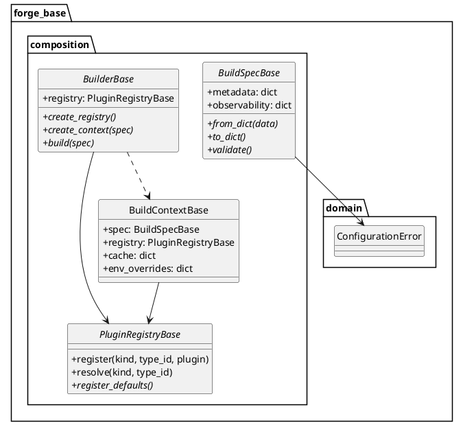
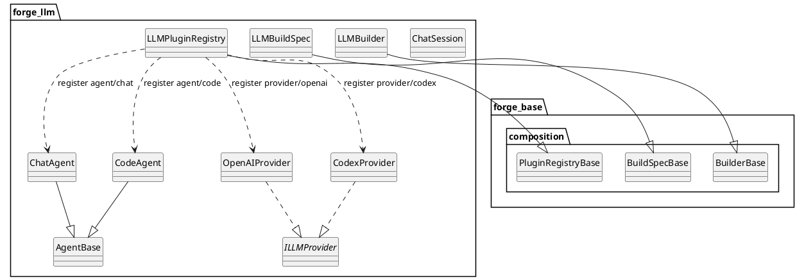

# Proposta v3.1 — Sistema de Plugins para ForgeBase

> **Extensibilidade sem modificar o núcleo.**

Esta é a **versão consolidada e correta** da proposta de arquitetura de plugins do **ForgeBase**.
O documento descreve **exclusivamente** o framework de composição (`forge_base`) e, **ao final**, inclui um **exemplo explícito** de um projeto derivado (`forge_llm`) para ilustrar como classes concretas como `ChatAgent` e `CodeAgent` entram no sistema.

---

## Escopo do Documento (Importante)

* Este documento **não define agentes concretos**.
* Ele define o **framework de composição** que outros projetos usam.
* Classes como `ChatAgent`, `CodeAgent`, `OpenAIProvider` pertencem a projetos derivados (ex.: `forge_llm`).

Esse recorte é intencional e necessário para manter **Clean Architecture**.

---

## Changelog

| Versão | Alteração                                                         |
| ------ | ----------------------------------------------------------------- |
| v3.0   | Introdução do sistema de composição e plugins                     |
| v3.1   | Consolidação, correções conceituais e exemplo de projeto derivado |

---

## Conceitos‑chave

* **Spec** descreve *o que* construir.
* **Registry** declara *o que existe*.
* **Builder** é o *Composition Root*: o único lugar onde objetos são criados.

Regra de ouro:

> **Quem usa não cria. Quem cria não usa.**

---

## Diagrama — ForgeBase (framework de composição)



---

## Estrutura do ForgeBase

```
forge_base/
├── composition/
│   ├── plugin_registry.py
│   ├── build_spec.py
│   ├── build_context.py
│   └── builder.py
│
└── domain/
    └── exceptions.py
```

---

## Componentes do ForgeBase

### PluginRegistryBase

Registro de extensibilidade.
Mapeia `(kind, type_id) → classe/factory`.

### BuildSpecBase

Spec declarativa (YAML / JSON / TOML).
Define **o que** será montado.

### BuildContextBase

Estado do build (spec + registry + cache + env).

### BuilderBase

Composition Root.
O único lugar onde objetos são criados.

---

# Exemplo Completo — Projeto Derivado `forge_llm`

Esta seção **não faz parte do ForgeBase**.
Ela existe apenas para mostrar como um projeto real usa o framework.

---

## Diagrama — forge_llm usando ForgeBase



---

## Código ilustrativo (forge_llm)

```python
class LLMPluginRegistry(PluginRegistryBase):
    def register_defaults(self):
        self.register("agent", "chat", ChatAgent)
        self.register("agent", "code", CodeAgent)
        self.register("provider", "openai", OpenAIProvider)
        self.register("provider", "codex", CodexProvider)
```

```python
class LLMBuilder(BuilderBase):
    def build(self, spec):
        ctx = self.create_context(spec)
        provider_cls = ctx.resolve("provider", spec.provider["type"])
        provider = provider_cls(...)
        agent_cls = ctx.resolve("agent", spec.agent["type"])
        return agent_cls(provider=provider)
```

---

## Conclusão

* `forge_base` é o **framework de composição**.
* `forge_llm` é um **projeto derivado** que define agentes e providers.
* `ChatAgent` e `CodeAgent` **não pertencem ao forge_base**.
* O documento agora mostra **onde cada coisa vive**.

Essa é a **última versão correta e completa** da proposta.
s
